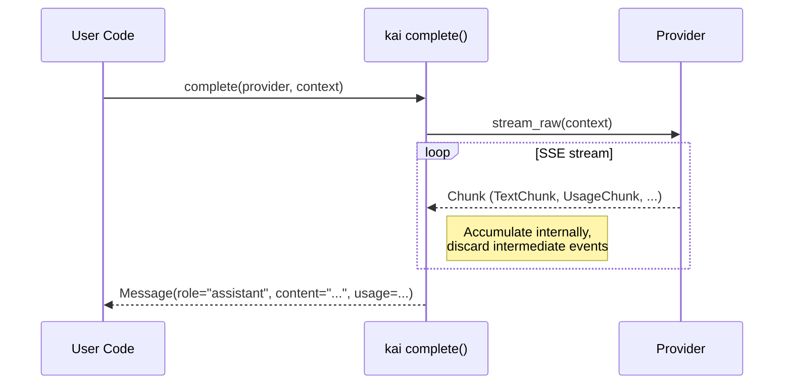
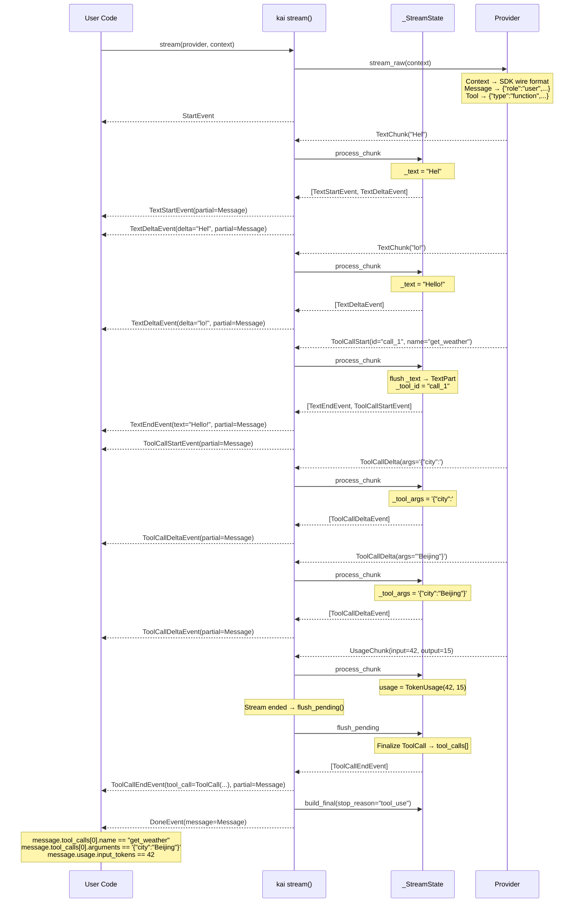

# kai

Unified multi-provider LLM API for the k agent framework.

kai provides a simple, provider-agnostic interface for streaming LLM completions with tool calling support. It has two entry points — `stream()` for real-time events and `complete()` for one-shot responses.

## Installation

```bash
uv add kai
```

## Quick Start

```python
import asyncio
from kai import OpenAICompletions, Context, Message, complete

async def main():
    provider = OpenAICompletions(model="gpt-4o")
    context = Context(
        system="You are a helpful assistant.",
        messages=[Message(role="user", content="Hello!")],
    )
    message = await complete(provider, context)
    print(message.extract_text())

asyncio.run(main())
```

## API Overview

### Two Entry Points

| Function | Returns | Use When |
|----------|---------|----------|
| `complete(provider, context)` | `Message` | You need the full response at once |
| `stream(provider, context)` | `AsyncIterator[StreamEvent]` | You want real-time token-by-token output |

### Providers

| Provider | Class | Env Variable |
|----------|-------|-------------|
| OpenAI Completions (+ compatible APIs) | `OpenAICompletions(model=...)` | `OPENAI_API_KEY` |
| OpenAI Responses | `OpenAIResponses(model=...)` | `OPENAI_API_KEY` |
| Anthropic | `Anthropic(model=...)` | `ANTHROPIC_API_KEY` |

Both classes accept `api_key` and `base_url` for explicit configuration.

### Message Types

```python
# Simple text
Message(role="user", content="Hello")

# Multimodal (text + image)
Message(role="user", content=[
    TextPart(text="What's in this image?"),
    ImagePart(data=base64_data, mime_type="image/png"),
])

# Tool result
Message.tool_result(tool_call_id, "result text")
```

### Stream Events

When using `stream()`, events are emitted with pattern matching:

```python
async for event in await stream(provider, context):
    match event:
        case StartEvent():           ...  # Stream started
        case TextStartEvent():       ...  # New text block
        case TextDeltaEvent(delta):  ...  # Text fragment
        case TextEndEvent(text):     ...  # Text block complete
        case ThinkStartEvent():      ...  # Thinking started
        case ThinkDeltaEvent(delta): ...  # Thinking fragment
        case ThinkEndEvent(text):    ...  # Thinking complete
        case ToolCallStartEvent():   ...  # Tool call started
        case ToolCallDeltaEvent():   ...  # Tool call args fragment
        case ToolCallEndEvent(tc):   ...  # Tool call complete
        case DoneEvent(message):     ...  # Stream finished
        case ErrorEvent(error):      ...  # Error occurred
```

Every event carries a `partial` field with the accumulated message so far.

### Tool Calling

kai provides declarative tool definitions — no execution logic. Define tools as JSON Schema, execute them yourself:

```python
tool = Tool(
    name="get_weather",
    description="Get weather for a city.",
    parameters={
        "type": "object",
        "properties": {"city": {"type": "string"}},
        "required": ["city"],
    },
)

response = await complete(provider, Context(messages=messages, tools=[tool]))
if response.tool_calls:
    for tc in response.tool_calls:
        result = your_execute_fn(tc.name, tc.arguments)
        messages.append(response)
        messages.append(Message.tool_result(tc.id, result))
```

### Custom / Compatible Providers

Use `OpenAICompletions` with `base_url` for any OpenAI-compatible API:

```python
# DeepSeek
provider = OpenAICompletions(model="deepseek-chat", base_url="https://api.deepseek.com")

# Local Ollama
provider = OpenAICompletions(model="llama3", api_key="ollama", base_url="http://localhost:11434/v1")

# Together AI
provider = OpenAICompletions(model="meta-llama/...", base_url="https://api.together.xyz/v1")
```

### Error Handling

```python
from kai.errors import StatusError, ConnectionError, TimeoutError, ProviderError

try:
    msg = await complete(provider, context)
except StatusError as e:
    print(f"HTTP {e.status_code}: {e}")
except ConnectionError:
    print("Connection failed")
except TimeoutError:
    print("Request timed out")
```

With `stream()`, errors arrive as `ErrorEvent` instead of exceptions.

### Extended Thinking (Anthropic)

```python
provider = Anthropic(
    model="claude-sonnet-4-20250514",
    thinking={"type": "enabled", "budget_tokens": 5000},
)

async for event in await stream(provider, context):
    match event:
        case ThinkDeltaEvent(delta=text):
            print(f"💭 {text}", end="")
        case TextDeltaEvent(delta=text):
            print(text, end="")
```

## Examples

See the [`examples/`](examples/) directory for runnable demos covering streaming, tool calling, multi-turn conversations, multimodal input, error handling, and more.

## Architecture

**Dual-layer streaming**: Providers yield raw `Chunk` objects. The `stream()` function accumulates them into rich `StreamEvent` objects, each carrying a `partial` message snapshot — so consumers always have the full state.

### `complete()` — One-shot Flow

`complete()` is a thin wrapper over `stream()`. It silently consumes all events and returns the final `Message`:



### `stream()` — Real-time Event Flow

`stream()` exposes every intermediate step. Each event carries a `partial` message snapshot reflecting state accumulated so far:


